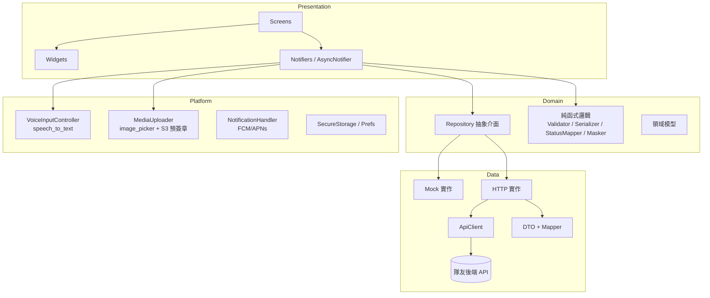
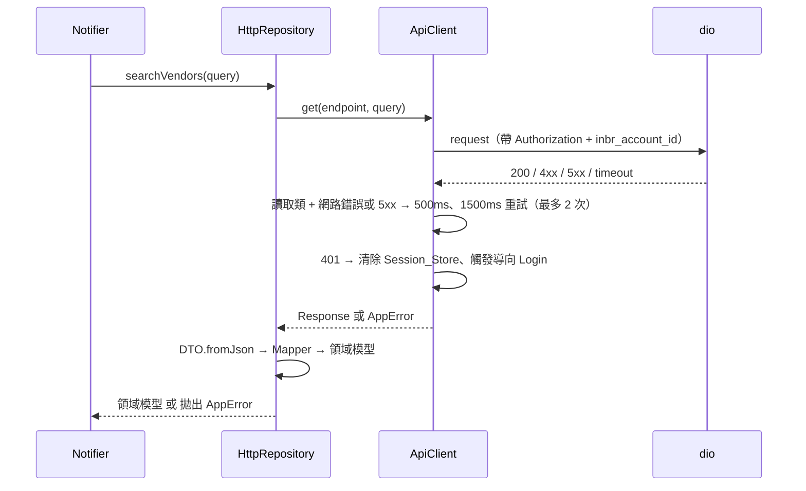

# Design Document

## Overview

本文件描述 Butler_App（AI 生活管家消費者端 Flutter App）改版的技術設計，對應 `requirements.md` 的 22 條需求。

設計目標優先序：

1. **可抽換**：後端與 App 並行開發，畫面層不得知道資料從 mock 還是 HTTP 來。比賽現場改一個設定值即可切換。
2. **流暢**：轉場、動畫、載入狀態集中定義，避免各畫面各自發明。
3. **資料驅動**：諮詢單題型由後端資料決定，App 不硬編題目結構。
4. **可驗證**：核心邏輯（表單序列化、驗證、狀態對照、遮罩）與 UI 解耦，能以單元測試與屬性測試驗證。

### 既有專案沿用與調整

| 項目 | 現況 | 調整 |
| --- | --- | --- |
| 導覽 | `go_router` 14.x，`ShellRoute` + `NoTransitionPage` | 改為 `StatefulShellRoute.indexedStack` 以保留分頁狀態（R18.5），自訂 `CustomTransitionPage` 提供共享軸轉場（R18.1-3） |
| 狀態管理 | `flutter_riverpod` 2.x 已在依賴但未使用 | 全面採用，Repository 以 provider 注入（R21.4） |
| 網路 | `dio` 5.x，`ApiService` 單一巨型類別 | 拆為 `ApiClient`（攔截器、逾時、重試、錯誤轉換）+ 7 個 Repository（R21.1-2） |
| 語音 | `speech_to_text` 7.x 已在依賴 | 包成 `VoiceInputController`，語系固定 `zh_TW`（R14.3） |
| 本機儲存 | `shared_preferences` | 一般偏好用它；憑證改用 `flutter_secure_storage`（R2.1 要求安全儲存區） |
| 色彩 | `AppColors` 為冷色藍紫（`#4F46E5`）＋冷灰底（`#F8FAFC`） | 重寫為暖色米白底＋管家綠主色（R17.1-2） |
| 表單模型 | `form_field_model.dart` 用字串題型（text/select） | 重寫為 `pms_form_topic.type` 兩位數字代碼（R21.14-15） |
| `supabase_flutter` | 在依賴但無任何 import | 移除（R21.13） |

新增依賴（皆為官方或高採用度套件，版本鎖定）：

| 套件 | 版本 | 用途 | 對應需求 | 狀態 |
| --- | --- | --- | --- | --- |
| `cached_network_image` | 3.4.1 | 遠端圖片解碼上限與淡入 | R18.13 | 已採用 |
| `shimmer` | 3.0.0 | 骨架載入 | R18.8 | 已採用 |
| `flutter_secure_storage` | 9.2.4 | 憑證與 inbr_account_id 安全儲存 | R2.1 | **暫緩，見下方替代方案** |
| `flutter_html` | 3.0.0 | HTML 內容渲染（intro/notice/terms） | R6.4, R6.7 | **暫緩，見下方替代方案** |
| `image_picker` | 1.1.2 | 照片選擇 | R10.1 | 待任務 9.8 導入 |
| `flutter_image_compress` | 2.3.0 | 上傳前壓縮 | R10.3 | 待任務 9.8 導入 |
| `permission_handler` | 11.3.1 | 麥克風、相機權限與導向系統設定 | R10.6, R14.8 | 待任務 9.8/10.5 導入 |
| `google_fonts` | 6.2.1 | Noto Sans TC 字體階層 | R17.3 | **不採用，見下方替代方案** |

dev_dependencies 新增 `integration_test`（SDK 內建）用於 R18.12 的效能量測，待任務 13.3 導入。

**離線環境的依賴替代方案**（實作時發現比賽現場可能無網路，`flutter pub get` 只能用本機 pub cache 已有版本）：

- `flutter_secure_storage` 不在本機 cache，暫以 `shared_preferences`（已在依賴中）實作 `SecureSessionStore`。這是已知的安全性妥協：`shared_preferences` 在 Android 上是明文 XML，不具 Keychain/Keystore 等級保護。已在 `lib/core/storage/secure_session_store.dart` 標註 `TODO(followup)`，介面不變，待網路環境允許時可直接替換內部實作。
- `flutter_html` 不在本機 cache，改用自製的 `SimpleHtmlView`（`lib/design_system/components/simple_html_view.dart`），只解析命題附件會用到的 `<p>`、`<b>`／`<strong>`、`<br>` 標籤，並移除 `<script>`／`<iframe>` 內容（滿足 R6.6）。複雜排版需求出現時再評估換回 `flutter_html`。
- `google_fonts` 在執行期下載字型，離線環境會顯示不出字或延遲，改用平台內建中文字型（`Noto Sans TC` / `PingFang TC` / `Microsoft JhengHei`）透過 `fontFamilyFallback` 指定，不採用 `google_fonts`。

## Architecture

### 分層



規則：

- Presentation 只 import Domain。禁止 import `dio`、DTO 或 mock 資料。
- Domain 的純函式邏輯不依賴 Flutter，可在 `dart test` 下直接跑（利於屬性測試）。
- Data 層負責 DTO 解析與領域模型轉換，所有 HTTP 細節不外洩。

### 目錄結構

```text
lib/
├── main.dart
├── app.dart                        # MaterialApp.router + Theme 組裝
├── core/
│   ├── config/
│   │   ├── environment_config.dart # dataSource / aiSource / baseUrl / guestBrowsing
│   │   └── api_endpoints.dart      # 所有後端路徑集中處（R21.7）
│   ├── error/
│   │   ├── app_error.dart          # 4 種錯誤類型（R22.4）
│   │   └── error_presenter.dart    # 錯誤 → 文案與樣式（R22.5）
│   ├── network/
│   │   ├── api_client.dart         # 逾時、重試、401、日誌（R22.1-3, R22.9）
│   │   └── interceptors/
│   ├── storage/
│   │   ├── secure_session_store.dart
│   │   └── draft_store.dart
│   └── utils/
│       ├── pii_masker.dart         # 遮罩純函式（R11.4-5）
│       └── result.dart
├── design_system/
│   ├── app_theme.dart              # ThemeData 淺色 / 深色
│   ├── app_colors.dart             # 11 組語意色票 + 7 類別色票
│   ├── app_typography.dart         # 7 級字階
│   ├── app_spacing.dart            # 間距 / 圓角 / 陰影
│   ├── app_motion.dart             # 時長 / 曲線 / 轉場工廠（R18.1-2）
│   ├── theme_extensions.dart       # ButlerTheme ThemeExtension
│   └── components/                 # 按鈕、輸入框、卡片、標籤、對話框、skeleton
├── domain/
│   ├── models/                     # 領域模型（不可變、value equality）
│   ├── repositories/               # 7 個抽象介面（R21.1）
│   └── logic/
│       ├── form_answer_serializer.dart   # 附錄 C 契約（R9.3-6）
│       ├── form_validator.dart           # R8.1-4
│       ├── quotation_calculator.dart     # R8.5-8
│       ├── order_status_mapper.dart       # 附錄 B（R15.5-7）
│       └── date_range_resolver.dart       # D 日偏移（R7.16）
├── data/
│   ├── dto/
│   ├── mappers/
│   ├── mock/                       # mock 資料集與 mock 實作
│   └── remote/                     # HTTP 實作
├── features/
│   ├── auth/                       # login, notifier
│   ├── account/
│   ├── home/
│   ├── service_catalog/
│   ├── vendor/                     # list, filter, detail
│   ├── form/                       # dynamic form engine + screens
│   ├── butler_chat/
│   ├── orders/
│   └── notification/
├── providers/                       # 全域 provider 組裝與覆寫點
└── router/
    ├── app_router.dart
    ├── route_guard.dart
    └── routes.dart                  # 路徑常數與需登入分類（R2.5）
```

## Components and Interfaces

### 1. Environment_Config

```dart
enum DataSource { mock, remote }

class EnvironmentConfig {
  const EnvironmentConfig({
    required this.dataSource,
    required this.aiSource,
    required this.baseUrl,
    required this.guestBrowsing,
  });

  final DataSource dataSource;
  final DataSource aiSource;
  final String baseUrl;
  final bool guestBrowsing;

  /// 讀取 --dart-define，未提供時採 demo 安全預設值。
  factory EnvironmentConfig.fromEnvironment() => const EnvironmentConfig(
        dataSource: DataSource.mock,
        aiSource: DataSource.mock,
        baseUrl: String.fromEnvironment('BASE_URL', defaultValue: ''),
        guestBrowsing: false, // R2.10
      );
}
```

切換方式：`flutter run --dart-define=DATA_SOURCE=remote --dart-define=BASE_URL=https://...`。現場只改這一行，不動程式碼（R21.3-4）。

### 2. Repository 抽象介面（R21.1）

7 組能力，每組一個介面，各有 `MockXxxRepository` 與 `HttpXxxRepository`：

| 介面 | 方法 | 對應後端接點 |
| --- | --- | --- |
| `AuthRepository` | `login(account, password)` → `AuthSession`；`logout()` | 登入 |
| `AccountRepository` | `fetchProfile()`；`updateContact(ContactInfo)`；`changePassword(...)` | 設定會員資訊 |
| `ServiceCatalogRepository` | `fetchCategories()` | 服務項目主檔 |
| `VendorRepository` | `searchVendors(VendorQuery)` → `Page<VendorSummary>`；`fetchVendorDetail(id)` | 尋找特定服務的廠商 |
| `FormRepository` | `fetchForm(formId)` → `FormDefinition` | 表單定義 |
| `FeedbackRepository` | `submit(FeedbackDraft)` → `FeedbackReceipt` | 建立 feedback |
| `OrderRepository` | `fetchInbox()` → `OrderInbox`（feedbacks + orders） | 查看訂單 |

`VendorQuery` 承載 R5 的篩選條件，並帶 `page` / `pageSize`（預設 20）。

**能力探測**（R5.8-11）：`VendorSummary` 的 `rating`、`priceRange`、`isAvailable` 為 nullable。`VendorRepository.searchVendors` 額外回傳 `VendorCapabilities`（後端是否提供這三個欄位），由 `Vendor_Filter_Panel` 決定顯示哪些條件。首次查詢的回應即可推導能力，無需額外接點。

### 3. ApiClient（R22）

`dio` 之上加四層攔截器：



- 逾時：connect 10s、receive 20s（R22.1）。
- 重試只作用於冪等的讀取請求；寫入請求（登入、建立 feedback、更新會員資訊）不自動重試（R22.3），交由 UI 的重試按鈕。
- `AppError` 為 sealed class：`NetworkError`、`AuthError`、`ValidationError`（含 `fieldErrors: Map<String, String>`）、`ServerError`。
- 日誌攔截器輸出接點名稱、耗時、狀態（R22.9），並用欄位白名單過濾個資鍵（R11.7）。

### 4. Design System

`ButlerTheme` 以 `ThemeExtension` 攜帶需求指定的值，畫面一律從 `Theme.of(context).extension<ButlerTheme>()!` 取用（R17.8-9）。

色票方向（暖色米白底＋管家綠主色，取自參考圖 1 的視覺調性）：

| 語意 | 淺色 | 說明 |
| --- | --- | --- |
| primary | `#2F7D5D` | 管家綠，按鈕與強調 |
| primaryContainer | `#DCEFE4` | 選取態底色 |
| secondary | `#C97B3C` | 暖橘，次要動作與活動標籤 |
| accent | `#F2B544` | 管家高亮、AI 標記 |
| background | `#FBF7F0` | 暖米白，明度 97%（R17.2） |
| surface | `#FFFFFF` | 卡片 |
| surfaceVariant | `#F3EDE3` | 區塊分隔 |
| textPrimary | `#2A2724` | 對背景對比 13.4:1 |
| textSecondary | `#6B635A` | 對背景對比 5.1:1（R19.3） |
| border | `#E6DED2` | |
| success `#2E7D32` / warning `#B26A00` / error `#C62828` | | 皆對背景 ≥4.5:1 |

7 類別色票（R17.7，各與背景對比 ≥3:1）：清潔 `#2F7D5D`、家電清洗 `#2A6F97`、包裹寄送 `#8A5A2B`、餐廳訂位 `#B5462F`、美食外送 `#C2410C`、水電修繕 `#5B5BD6`、商城購物 `#7C3AED`。

字階以 Noto Sans TC 建 7 級：display 32/700/1.25、headline 24/700/1.3、title 18/600/1.4、bodyLarge 16/400/1.6、body 14/400/1.6、label 13/500/1.4、caption 12/400/1.4。

圓角 8/12/16/24；間距 4/8/12/16/24/32；陰影 3 級（卡片、浮動、對話框）。

### 5. Motion System（R18）

```dart
class AppMotion {
  static const Duration page = Duration(milliseconds: 300);      // R18.2
  static const Duration tab = Duration(milliseconds: 200);       // R18.6
  static const Duration press = Duration(milliseconds: 100);     // R18.9
  static const Duration listStagger = Duration(milliseconds: 40);// R18.7
  static const Curve emphasized = Curves.easeInOutCubicEmphasized;

  /// 系統開啟「減少動態效果」時回傳 Duration.zero（R18.14）
  static Duration resolve(BuildContext context, Duration base) =>
      MediaQuery.disableAnimationsOf(context) ? Duration.zero : base;
}
```

三種轉場包成 `Page` 工廠：`sharedAxisPage`（同層／父子層）、`fadeThroughPage`（登入 → 首頁、分頁切換）、Hero（卡片 → 詳情，由 `Hero` widget 搭配 `heroTag = 'vendor-${id}'` 完成）。

流暢度落實手段（對應「卡卡的」這個痛點）：

- `StatefulShellRoute.indexedStack` 保留四個分頁子樹，切換不重建（R18.5）。
- 所有清單用 `ListView.builder` / `SliverList`（R18.10）。
- 排序、篩選、格式化在 Notifier 內完成並快取結果，`build` 只讀已算好的不可變資料（R18.11）。
- `CachedNetworkImage` 指定 `memCacheWidth`（R18.13）。
- 載入超過 200ms 才顯示 skeleton，避免閃爍（R18.8）：用 `Future.any` 搭配 200ms 計時器決定是否進入 skeleton 狀態。
- 進場動畫用 `AnimationController` 單一控制器驅動，避免每個 item 各自建 controller。

### 6. Routing 與 Route_Guard

```dart
// routes.dart
const guestBrowsableRoutes = {Routes.home, Routes.serviceCatalog, Routes.vendorList, Routes.vendorDetail, Routes.chat};
const authRequiredRoutes  = {Routes.form, Routes.orders, Routes.orderDetail, Routes.account};
```

`GoRouter.redirect` 實作 R2.5-9 的決策表：

| guestBrowsing | 已登入 | 目標分類 | 結果 |
| --- | --- | --- | --- |
| false | 否 | 任何非 Login | → Login，記錄 `from` |
| false | 是 | 任何 | 允許 |
| true | 否 | 可訪客瀏覽 | 允許 |
| true | 否 | 需登入 | → Login，記錄 `from` |
| true | 是 | 任何 | 允許 |
| 任一 | 是 | Login | → Home |

登入成功後讀 `from` 並 `go(from)`（R2.9）。`redirect` 依賴 `authStateProvider`，以 `refreshListenable` 訂閱，登出或 401 時自動重算。

路由表：

```text
/login
/                          （shell: 首頁）
/services                  （shell: 服務分頁 = Service_Catalog_Screen）
/orders                    （shell: 訂單紀錄）
/account                   （shell: 個人）
/vendors?serviceId=&keyword=   Vendor_List_Screen（serviceId 可省略 → 全部服務，R5.20）
/vendors/:vendorId             Vendor_Detail_Screen
/forms/:formId                 Form_Screen（extra 帶 prefill 與 serviceId）
/orders/:orderNo               Order_Detail_Screen
/chat                          Butler_Chat_Screen（shell 外，全螢幕）
```

### 7. 動態表單引擎（R7、R8、R9）

領域模型：

```dart
class FormDefinition {
  final int formId;
  final int serviceVendorId;
  final String type;      // '1'..'5'
  final String subType;   // '1' 一般 / '2' 估價
  final String name;
  final String? introContent, noticeContent, termsContent;
  final List<FormGroup> groups;   // 依 sort 排序
}

class FormTopic {
  final int topicId;
  final TopicType type;           // enum，backed by '01'..'10'
  final String title;
  final String? remark;
  final bool isRequired;
  final int sort;
  final bool isNumberOnly;
  final int? minMedias, maxMedias, specifiedMedias;
  final int? startDateOffsetDays, endDateOffsetDays;
  final List<TopicOption> options;
  final List<TopicMedia> medias;
}
```

`TopicType` 為 enum 並帶未知值兜底：

```dart
enum TopicType {
  shortText('01'), longText('02'), singleChoice('03'), multiChoice('04'),
  region('05'), photo('06'), notice('07'), contactWithAddress('08'),
  date('09'), contactWithoutAddress('10'), unsupported('__');

  static TopicType fromCode(String raw) => values.firstWhere(
      (t) => t.code == _normalize(raw), orElse: () => TopicType.unsupported);
}
```

`_normalize` 同時接受 `'1'` 與 `'01'`（附件 JSON 兩種寫法都出現過），統一補零。未知代碼落到 `unsupported`，渲染成「此題型尚未支援」提示卡並繼續渲染其餘題目（R7.18）。這條是刻意的容錯設計：後端隨時可能加題型，App 不能因此整頁掛掉。

**渲染註冊表**：`Map<TopicType, TopicWidgetBuilder>`，每個題型一個獨立 widget 檔。新增題型只需加一列，不改 renderer 本體。

**作答值模型**：`FormAnswers` 為 `Map<int topicId, AnswerValue>` 的不可變包裝。`AnswerValue` 為 sealed class（`TextAnswer`、`OptionAnswer`、`OptionListAnswer`、`RegionAnswer`、`MediaAnswer`、`ContactAnswer`、`DateAnswer`），與附錄 C 的序列化型別一對一。

序列化由純函式 `FormAnswerSerializer.toFeedbackContent(definition, answers)` 完成，不碰 UI，可直接屬性測試。

**題型 5 與 8 的地區共存**（R7.24-28）：兩題各自持有 `RegionAnswer`，互不同步。`FeedbackDraftBuilder` 依 R7.25-26 的優先序決定 `contact_address_*` 取值；不一致時只提示不阻擋送出。

**估價試算**（R8.5-8）：`QuotationCalculator.calculate(answers, definition)` 回傳 `QuotationResult(lineItems, total, hasSeparatelyQuoted)`。`is_quoted_separately` 的選項以 0 計入並回報旗標，供 UI 顯示另行報價說明。

**草稿**（R8.9-13）：`DraftStore` 以 `form_id` 為 key 寫 `shared_preferences`，Notifier 內以 1 秒 debounce 觸發（`Timer` 重設）。

### 8. AI 服務介面（R12、R13）

```dart
abstract interface class ButlerAiService {
  Stream<ButlerChunk> send(ButlerRequest request);   // 串流，支援打字機效果
  Future<IntentResult> classify(String utterance);   // service_id + 信心值
  Future<PrefillResult> prefill(String utterance, FormDefinition definition);
  Future<String> explainTopic(FormTopic topic);      // 「AI 教你填表單」
}
```

三種實作（R13.10）：`MockButlerAiService`（關鍵字腳本，離線可跑）、`BackendProxyButlerAiService`（打隊友後端，後端接 Bedrock）、`BedrockButlerAiService`（保留擴充位，現場若允許 App 直呼再補）。

`ButlerChunk` 為 sealed：`TextDelta`、`SuggestionChips`、`CategoryCard`、`VendorCard`、`PrefillCard`、`Done`、`Failed`。串流以 `StreamController` 產出，UI 收到 `TextDelta` 就 append，更新間隔節流在 50ms 內（R12.4）。

**AI 預填不可自動送單**：`PrefillCard` 只提供「檢視並編輯」按鈕，導向帶 `prefill` 的 `Form_Screen`。`FeedbackRepository.submit` 的唯一呼叫點在 `Form_Screen` 的送出按鈕（R13.7）。AI 填入的題目在 `FormAnswers` 內以 `aiFilledTopicIds` 集合標記，使用者一改動就從集合移除（R13.11）。

### 9. Order_Status_Mapper（R15.5-7）

純查表函式，資料來源為附錄 B：

```dart
class OrderStatusMapper {
  static OrderStatusView map(String orderType, String orderStatus) { ... }
  // 未知 status → OrderStatusView('處理中', neutral, group: inProgress) + 寫日誌
  // 未知 type   → 類別名稱 '其他服務'
}
```

`order_type` `03/04/05/06` 共用同一張狀態表，以 fallback 鍵 `'default'` 表達，避免四份重複資料。

### 10. 個資遮罩（R11）

`PiiMasker` 純函式：`maskMobile('0912345678') == '09*****678'`（保留末 3 碼）、`maskEmail('abcdef@x.com') == 'ab****@x.com'`（保留 @ 前 2 字元）。短於保留長度的輸入以全遮罩處理，不得拋出例外。

App 端不做任何加密，不含金鑰（R11.2-3）。`ApiClient` 強制 `https` scheme，非 https 的 baseUrl 在啟動時 assert 失敗並顯示設定錯誤畫面（R11.1）。

## Data Models

領域模型全部不可變、覆寫 `==`／`hashCode`，以 `copyWith` 更新：

| 模型 | 關鍵欄位 |
| --- | --- |
| `AuthSession` | `inbrAccountId`（UUID v7 字串）、`accessToken`、`expiresAt?` |
| `MemberProfile` | `name`、`mobile`、`email`、`landline?`、`address?` |
| `ServiceCategory` | `serviceId`、`name`、`iconKey`、`colorKey`、`vendorCount?` |
| `VendorSummary` | `vendorId`、`name`、`description`、`imageUrl`、`serviceTags`、`rating?`、`priceRange?`、`isAvailable?`、`counties` |
| `VendorDetail` | 繼承 summary ＋ `formId`、`introContent`、`noticeContent`、`termsContent` |
| `FormDefinition` / `FormGroup` / `FormTopic` / `TopicOption` / `TopicMedia` | 見上節 |
| `FeedbackDraft` | `serviceId`、`formId`、`formType`、`answers`、`contact*`、`preferredContactTime`、`description` |
| `FeedbackReceipt` | `feedbackNo`、`createdAt` |
| `ConsultationItem` | `feedbackNo`、`serviceName`、`submittedAt`、`status` |
| `OrderItem` | `orderNo`、`orderType`、`orderStatus`、`finalAmount`、`orderTime` |
| `OrderInbox` | `consultations`、`orders` |

DTO 與領域模型一律分離。DTO 的所有非必填欄位以預設值解析（R21.10）；必填欄位缺失或型別不符時拋 `DtoParseException` 並記錄接點名稱（R21.11）。

### Mock 資料集

`data/mock/` 依命題附件的結構準備：7 個服務類別、每類別 4~8 家服務商、至少 3 份涵蓋全部 10 種題型的表單定義、22 種訂單狀態各一筆訂單、縣市與行政區用附件的完整清單。目標是 mock 模式下能離線走完整流程（R21.5），現場後端沒接上也能 demo。

## Error Handling

| 錯誤類型 | 觸發 | UI 呈現 |
| --- | --- | --- |
| `NetworkError` | 逾時、DNS、離線 | 全頁錯誤態（首屏）或 SnackBar（次要操作）＋重試 |
| `AuthError` | 401 | 清 session、導向 Login、顯示「登入已逾期，請重新登入」 |
| `ValidationError` | 400 帶欄位錯誤 | 錯誤訊息貼回對應題目下方（R9.12） |
| `ServerError` | 5xx、解析失敗 | 全頁錯誤態＋重試＋「稍後再試」文案 |

離線提示條（R22.7-8）由 `connectivityProvider` 驅動，掛在 `App_Shell` 頂部，恢復連線時觸發當前畫面的 `invalidate`。

三態（loading / data / error）由 `AsyncValue` 統一表達，配 `AsyncValueWidget` 包裝器，確保每個畫面的三態呈現一致，不會有人漏做錯誤態。

## Correctness Properties

以下屬性為程式必須恆成立的性質，將以屬性測試驗證（生成器＋固定種子清單，跑在 `flutter_test`）：

### Property 1: 表單序列化型別契約

對任意合法 `FormDefinition` 與任意合法 `FormAnswers`，`toFeedbackContent` 產出的每個 `answers` 元素，其 `value` 的 JSON 型別必等於附錄 C 為該 `type` 指定的型別，且 `type` 為兩位數字字串。
**Validates: Requirements 9.3, 9.4**

### Property 2: 題型 7 不入序列化

對任意含題型 07 的定義，產出的 `answers` 不含該 topic_id。
**Validates: Requirements 9.6**

### Property 3: 序列化為 JSON-safe

`toFeedbackContent` 的產出對任意輸入皆可通過 `jsonEncode` 且不拋例外。
**Validates: Requirements 9.3, 9.4, 9.5, 9.6**

### Property 4: 驗證與必填一致

對任意定義，若 `FormValidator.validate` 回傳無錯誤，則每個 `isRequired` 為 true 的非 07 題型皆有非 null 且非空的作答值；反之若存在必填未填，回傳的錯誤集合必包含該 topic_id。
**Validates: Requirements 8.1**

### Property 5: 照片張數界限

對任意 `minMedias ≤ n ≤ maxMedias` 的張數，驗證通過；對任意 `n < minMedias`，驗證必回報該題錯誤。
**Validates: Requirements 8.3**

### Property 6: 估價單調性

固定其他條件，任一含正 `unit_price` 選項的數量增加時，`QuotationResult.total` 不減少；且 `total` 恆等於所有非 `is_quoted_separately` 選項的 `unit_price × quantity` 之和。
**Validates: Requirements 8.5, 8.6, 8.7**

### Property 7: 日期範圍封閉

對任意 `startDateOffsetDays ≤ endDateOffsetDays`，`DateRangeResolver` 產出的可選範圍恰為 `[today+start, today+end]`，且範圍內每一天皆被判定可選、範圍外每一天皆被判定不可選。
**Validates: Requirements 7.16**

### Property 8: 狀態對照全覆蓋且不拋錯

對任意兩位字串組合 `(orderType, orderStatus)`，`OrderStatusMapper.map` 必回傳非 null 結果且不拋例外；對附錄 B 列出的每個組合，回傳的顯示名稱與分組必與表格一致。
**Validates: Requirements 15.5, 15.6, 15.7**

### Property 9: 遮罩不洩漏且不擴張

對任意字串輸入，`maskMobile` 產出的可見字元數不超過 3、`maskEmail` 在 `@` 前的可見字元數不超過 2；產出長度等於輸入長度；對任意輸入皆不拋例外。
**Validates: Requirements 11.4, 11.5**

### Property 10: 地區選單一致性

對任意縣市選擇序列，最終的 `district_code` 必屬於當前 `county_code` 之下，或為空。
**Validates: Requirements 5.12, 5.13, 7.10**

### Property 11: 路由守衛決定性

對 `(guestBrowsing, isLoggedIn, targetRoute)` 的所有組合，`RouteGuard.resolve` 必回傳唯一結果，且結果與 R2 決策表一致；已登入者永不被導向 Login（除主動登出）。
**Validates: Requirements 2.5, 2.6, 2.7, 2.8, 2.9**

### Property 12: DTO 往返

對任意領域模型，經 mapper 轉 DTO 再轉回，結果與原模型相等（限有雙向 mapper 的模型）。
**Validates: Requirements 21.9**

### Property 13: 未知題型不中斷渲染

對任意含未知題型代碼的定義，`Dynamic_Form_Renderer` 產出的 widget 數量等於題目總數（未知者渲染為提示卡），不拋例外。
**Validates: Requirements 7.18**

## Testing Strategy

| 層次 | 範圍 | 工具 |
| --- | --- | --- |
| 屬性測試 | Property 1–Property 13，Domain 的純函式邏輯 | `flutter_test` ＋ 自訂生成器（固定種子清單，失敗可重現） |
| 單元測試 | Mapper、ApiClient 重試與 401、DraftStore、Notifier 狀態機 | `flutter_test`、`dio` mock adapter |
| Widget 測試 | 10 種題型渲染與驗證錯誤定位、三態呈現、遮罩顯示、篩選面板能力探測 | `flutter_test` |
| 整合測試 | mock 模式跑完「登入 → 首頁 → 類別 → 服務商列表篩選 → 詳情 → 填單 → 送出 → 訂單」 | `integration_test` |
| 效能量測 | R18.12 的清單滑動幀時間 | `integration_test` ＋ `TimelineSummary` |

生成器不引入第三方 PBT 套件，改用手寫 generator ＋ 固定種子陣列（`[1, 7, 42, 1337, 20260801]`），保證 CI 可重現且不增加依賴解析風險。

## Backend Integration Points

所有待串接位置以 `// TODO(backend):` 標註（R21.6），並集中列於 `docs/backend-integration.md`（R21.8）：

| # | 接點 | 抽象介面 | App 期望請求 | App 期望回應 |
| --- | --- | --- | --- | --- |
| 1 | 登入 | `AuthRepository.login` | `{account, password}` | `{inbr_account_id, access_token}` |
| 2 | 設定會員資訊 | `AccountRepository.updateContact` | 聯絡欄位明文 | `{success}` 或欄位錯誤 |
| 3 | 變更密碼 | `AccountRepository.changePassword` | `{old, new}` | `{success}` |
| 4 | 服務類別 | `ServiceCatalogRepository.fetchCategories` | 無 | `cms_homepage_service` 清單 |
| 5 | 尋找特定服務的廠商 | `VendorRepository.searchVendors` | `service_id` ＋篩選＋分頁 | `service_vendor_id` 清單＋總筆數 |
| 6 | 服務商詳情 | `VendorRepository.fetchVendorDetail` | `vendor_id` | 服務商欄位＋`form_id`＋三段 HTML |
| 7 | 表單定義 | `FormRepository.fetchForm` | `form_id` | form＋group＋topic＋option＋media（**期望單一接點一次回傳**） |
| 8 | 建立 feedback | `FeedbackRepository.submit` | 見附錄 C ＋ contact_* ＋ `platform_code: '01'` | `{feedback_no}` |
| 9 | 查看訂單 | `OrderRepository.fetchInbox` | `inbr_account_id` | `{feedbacks: [], orders: []}` |
| 10 | 照片預簽章 | `MediaUploader` | `{filename, content_type}` | `{upload_url, file_id}` |
| 11 | 推播 token 註冊 | `NotificationHandler` | `{token, platform}` | `{success}` |

隊友的 API 格式一旦定稿，只需改 `data/remote/` 內的 DTO 與 `api_endpoints.dart`，Domain 與 Presentation 不動。

## Design Decisions

**為何 Riverpod 而非 Bloc**：依賴已在 `pubspec.yaml`，且 `AsyncValue` 天然表達三態（R22.6），`ProviderScope.overrides` 是 mock／remote 切換最省事的注入點（R21.4）。

**為何 `StatefulShellRoute.indexedStack` 而非 `ShellRoute`**：現況用 `ShellRoute` + `NoTransitionPage`，切分頁會重建整個子樹，這正是「卡卡的」來源之一。`indexedStack` 保留每個分頁的 Element 樹與滑動位置（R18.5, R4.15）。

**為何題型用 enum 而非字串**：現有 `form_field_model.dart` 用 `'text'`／`'select'` 這類字串，與 DB 的數字代碼對不上，比賽現場改欄位會靜默失敗。enum ＋ `unsupported` 兜底讓不匹配在編譯期或渲染時明確暴露（R21.14-15, R7.18）。

**為何 mock 是預設值**：現場後端可能晚於 App 就緒。預設 mock 讓 demo 隨時可跑，切 remote 只是一個 `--dart-define`（R21.5）。

**為何 App 不做加密**：命題附件要求 AES-256-GCM ＋ SHA-256 hash，金鑰若進到 App 打包產物就等於公開。設計上明確把加密責任留在後端配 KMS（R11.2-3）。
