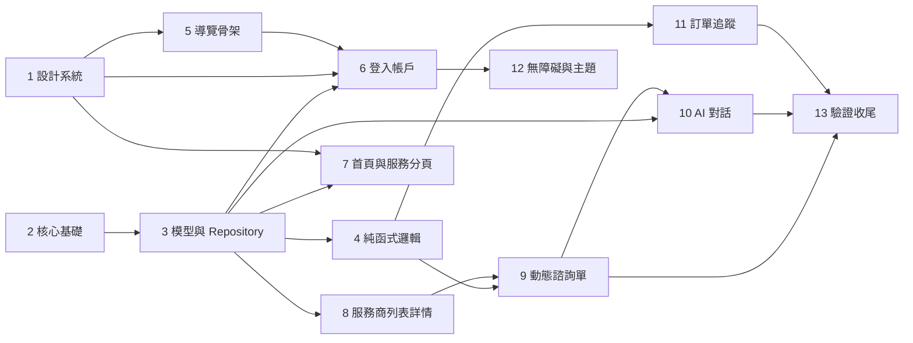

# Implementation Plan

## Overview

比賽時程壓縮，任務依「demo 動線先通、細節後補」排序。標記 P0 者為現場 demo 必備，P1／P2 視時間取捨。

任務分為 13 個階段，階段編號對應 `design.md` 的元件與流程；每個子任務結尾的 `_Requirements:_` 標註其覆蓋的 `requirements.md` 需求編號，作為驗收依據。階段之間的先後關係見下方「Task Dependency Graph」。

## Tasks

### 1. 專案基礎與設計系統

- [x] 1.1 清理依賴並加入新套件
  - 移除 `pubspec.yaml` 的 `supabase_flutter`
  - 加入 `cached_network_image` 3.4.1、`shimmer` 3.0.0（`flutter_secure_storage`／`google_fonts` 因離線環境不在 pub cache，改用替代方案，見 design.md「離線環境的依賴替代方案」）
  - 執行 `flutter pub get --offline` 確認解析成功
  - _Requirements: R21.13_

- [x] 1.2 建立設計系統色票與字階
  - 重寫 `design_system/app_colors.dart`：11 組語意色票（暖米白底 `#FBF7F0`、管家綠 `#2F7D5D`）＋ 7 組類別色票
  - 建立 `app_typography.dart`（7 級字階，平台內建中文字型 fallback）、`app_spacing.dart`（間距／圓角／陰影）
  - 寫測試驗證正文與背景對比度 ≥4.5:1、類別色票與背景對比度 ≥3:1（`test/design_system/app_colors_contrast_test.dart`）
  - _Requirements: R17.1-7, R19.3_

- [x] 1.3 建立 ThemeExtension 與元件樣式
  - `theme_extensions.dart` 定義 `ButlerTheme`，攜帶色票、間距、圓角、動畫時長
  - `app_theme.dart` 組出淺色與深色 `ThemeData`
  - 按鈕、輸入框、卡片、標籤、對話框樣式已納入 `AppTheme._build`；`components/` 目前有 skeleton／async 元件，獨立元件庫留待深化
  - _Requirements: R17.8-10, R20.1_

- [x] 1.4 建立 Motion System
  - `app_motion.dart`：時長常數、`emphasized` 曲線、`resolve()` 處理減少動態效果
  - 轉場工廠 `AppTransitions.sharedAxis`／`fadeThrough`／`modal`
  - `StaggeredItem`（列表進場）、`SkeletonBox`／`SkeletonList`／`DelayedLoader`（載入超過 200ms 才顯示 skeleton）
  - _Requirements: R18.1-2, R18.6-9, R18.14_

### 2. 核心基礎設施

- [x] 2.1 Environment_Config 與 API 端點常數
  - `environment_config.dart` 讀 `--dart-define`，預設 `dataSource: mock`、`aiSource: mock`、`guestBrowsing: false`
  - `api_endpoints.dart` 集中所有後端路徑（含 `// TODO(backend):` 標註）
  - _Requirements: R21.3, R21.7, R2.10_

- [x] 2.2 錯誤模型與呈現
  - `app_error.dart` sealed class：`NetworkError`、`AuthError`、`ValidationError`、`ServerError`、`DtoParseException`
  - `AsyncValueWidget` 包裝器統一三態呈現（含 `EmptyState`）；獨立 `error_presenter.dart` 尚未拆出，目前邏輯內嵌於 `AsyncValueWidget`
  - _Requirements: R22.4-6_

- [ ] 2.3 ApiClient
  - dio 攔截器：Authorization ＋ inbr_account_id、逾時 10s/20s、讀取類重試（500ms／1500ms，最多 2 次）、401 清 session、日誌（含個資鍵過濾）
  - 強制 https，非 https baseUrl 於啟動時失敗
  - 單元測試：重試次數與間隔、寫入請求不重試、401 行為
  - 尚未開始：目前資料層全走 mock，尚無 HTTP 實作需要此 client
  - _Requirements: R22.1-3, R22.9, R11.1, R11.7, R2.13_

- [x] 2.4 Session 與草稿儲存
  - `secure_session_store.dart` 以 `shared_preferences` 存憑證與 inbr_account_id（`flutter_secure_storage` 暫緩，見 design.md）
  - `draft_store.dart`（按 form_id 存草稿）尚未實作，對應 tasks 9.6
  - _Requirements: R2.1-3, R8.9_

- [x] 2.5 PiiMasker 與屬性測試
  - `maskMobile`、`maskEmail`、`maskName`、`maskAddressDetail`、`accountIdSuffix`、`redact` 純函式
  - 屬性測試 P9：可見字元數上限、長度不變、任意輸入不拋例外（`test/core/pii_masker_test.dart`）
  - _Requirements: R11.4-5_

### 3. 領域模型與 Repository 抽象

- [x] 3.1 領域模型
  - 建立 `AuthSession`、`MemberProfile`、`ServiceCategory`、`VendorSummary`、`VendorDetail`、`FeedbackDraft`、`FeedbackReceipt`、`ConsultationItem`、`OrderItem`、`OrderInbox`，全部不可變＋value equality（`lib/domain/models/domain_models.dart`）
  - _Requirements: R21.9, R21.12_

- [x] 3.2 表單領域模型（取代舊 form_field_model）
  - `TopicType` enum 以 `'01'`~`'10'` 為代碼，`fromCode` 接受 `'1'` 與 `'01'`，未知落 `unsupported`
  - `FormDefinition`／`FormGroup`／`FormTopic`／`TopicOption`／`TopicMedia`
  - `AnswerValue` sealed class 七種變體、`FormAnswers` 不可變容器
  - 已刪除舊 `lib/models/`（整個舊目錄，含 `form_field_model.dart`）
  - _Requirements: R21.14-15, R7.1-2_

- [x] 3.3 七個 Repository 抽象介面
  - `AuthRepository`、`AccountRepository`、`ServiceCatalogRepository`、`VendorRepository`、`FormRepository`、`FeedbackRepository`、`OrderRepository`（`lib/domain/repositories/repositories.dart`）
  - `VendorQuery`、`ResultPage<T>`（因與 Flutter 內建 `Page` 撞名而改名）、`VendorCapabilities`
  - _Requirements: R21.1_

- [x] 3.4 Mock 實作與 mock 資料集
  - 7 個服務類別、每類別 2~3 家服務商（可再擴充至 4~8 家）、涵蓋全部 10 種題型的 1 份表單定義（可再擴充至 3 份）、24 筆訂單涵蓋附錄 B 全部狀態、3 個縣市取樣資料
  - 每個 mock 方法加入約 350~500ms 模擬延遲
  - _Requirements: R21.2, R21.5, R1.10_

- [ ] 3.5 HTTP 實作與 DTO／Mapper 骨架
  - 尚未開始，待任務 2.3（ApiClient）完成後進行
  - `api_endpoints.dart` 已預留路徑與 `// TODO(backend):` 標註
  - _Requirements: R21.2, R21.6, R21.8-11_

- [x] 3.6 Provider 組裝
  - `repository_providers.dart` 依 `EnvironmentConfig.dataSource` 切換（目前 remote 分支暫時指回 mock 並標註 TODO，待 3.5 完成後補上）
  - _Requirements: R21.4_

### 4. 純函式邏輯與屬性測試

- [x] 4.1 FormAnswerSerializer
  - 依附錄 C 實作 `toFeedbackContent`
  - 屬性測試 P1（型別契約）、P2（題型 07 不入序列化）、P3（JSON-safe）
  - _Requirements: R9.3-6_

- [x] 4.2 FormValidator
  - 必填、數字限定、照片張數、聯絡格式驗證，回傳 `ValidationErrors`
  - 屬性測試 P4（驗證與必填一致）、P5（照片張數界限）
  - _Requirements: R8.1-4, R3.6-7_

- [x] 4.3 QuotationCalculator
  - 小計、總計、`is_quoted_separately` 以 0 計並回旗標
  - 屬性測試 P6（單調性與總計等式）
  - _Requirements: R8.5-8_

- [x] 4.4 DateRangeResolver
  - D 日偏移換算可選範圍
  - 屬性測試 P7（範圍封閉）
  - _Requirements: R7.16_

- [x] 4.5 OrderStatusMapper
  - 依附錄 B 建表，`03/04/05/06` 共用 fallback 鍵；未知 status → 「處理中」、未知 type → 「其他服務」
  - 屬性測試 P8（全覆蓋不拋錯、表格一致）
  - _Requirements: R15.5-7_

### 5. 導覽與 App 骨架

- [x] 5.1 路由表與 Route_Guard
  - `routes.dart` 定義路徑常數與 `categoryOf()`
  - `route_guard.dart` 實作決策表，`RouteGuard.resolve` 為純函式
  - 屬性測試 P11（決定性與決策表一致，`test/router/route_guard_test.dart`）
  - _Requirements: R2.4-9_

- [x] 5.2 App_Shell 改為 StatefulShellRoute.indexedStack
  - 4 個分頁：首頁、服務、訂單紀錄、個人；`StatefulShellRoute.indexedStack` 保留各分頁狀態
  - 分頁切換 `AnimatedSwitcher` 200ms
  - 頂部離線提示條尚未實作，對應 tasks 22（統一錯誤處理）
  - _Requirements: R4.14-15, R18.5-6, R22.7-8_

- [x] 5.3 套用轉場設定
  - `AppTransitions.sharedAxis`（列表→詳情）、`fadeThrough`（登入→首頁）、`modal`（表單／對話）
  - Hero 轉場已套用於服務商卡片→詳情
  - _Requirements: R18.3-4, R1.7_

### 6. 登入與帳戶（P0）

- [x] 6.1 Login_Screen
  - 帳號／密碼欄、密碼顯示切換、載入態、demo 快速登入按鈕、品牌視覺
  - 空欄位驗證、帳密錯誤、網路錯誤呈現已接上 `AuthState.errorMessage`
  - _Requirements: R1.3-12_

- [x] 6.2 AuthNotifier 與啟動導向
  - `AuthNotifier`（`session_providers.dart`）啟動時讀 Session_Store 還原登入狀態
  - `GoRouter.redirect` 依 `RouteGuard` 決策分流，登入成功導向記錄的 `from` 路徑
  - _Requirements: R1.1-2, R2.1-2, R2.9_

- [x] 6.3 登出與 401 處理
  - 確認對話框、`AuthNotifier.logout()` 清除身分資料、導向登入
  - `forceLogout()` 已定義但尚未接上 ApiClient 的 401 攔截（因 2.3 尚未實作）
  - _Requirements: R2.11-13_

- [x] 6.4 Account_Screen
  - 顯示會員名稱、遮罩手機與 Email、inbr_account_id 末 6 碼；四個項目入口
  - 遮罩欄位的「點選顯示 10 秒後恢復」互動尚未實作（目前固定遮罩顯示）
  - _Requirements: R3.1-4, R11.4, R11.6_

- [ ] 6.5 編輯聯絡資訊與變更密碼
  - 手機格式、Email 格式、密碼一致性與強度驗證；成功與失敗呈現
  - Account_Screen 的入口已建立但尚未接上實際編輯畫面
  - _Requirements: R3.5-11_

### 7. 首頁與服務類別（P0）

- [x] 7.1 Home_Screen 版面
  - 品牌標題、管家問候區、對話式輸入框、服務類別九宮格已完成；我的常用功能、活動輪播尚未實作
  - 右上角依登入狀態顯示「登入」按鈕或頭像
  - 下拉刷新已接上 `serviceCategoriesProvider`
  - _Requirements: R4.1-4, R4.7, R4.13, R3.1, R1.2_

- [x] 7.2 服務類別磁磚與常用功能
  - `ServiceCategoryTile`（線性圖示＋類別色票）已完成
  - 長按加入／移除常用功能、常用功能橫向清單尚未實作
  - _Requirements: R4.7-11_

- [x] 7.3 首頁對話入口
  - 點輸入框開對話畫面（`context.push(Routes.chat)`）；聚焦與「帶入首頁輸入文字」尚未串接
  - _Requirements: R4.5-6_

- [ ] 7.4 活動輪播（P1）
  - 尚未實作
  - _Requirements: R4.12_

- [x] 7.5 Service_Catalog_Screen（服務分頁）
  - 7 個類別完整清單＋各類別服務商筆數、跨類別關鍵字搜尋欄
  - 搜尋送出後開啟不限 service_id 的服務商列表
  - _Requirements: R4.16-19, R5.20_

### 8. 服務商列表與詳情（P0，本次流程重點）

- [x] 8.1 Vendor_List_Screen 基本清單
  - 服務商卡片（名稱、簡述、圖片、條件式評分）、標題區顯示類別名稱
  - 骨架卡片（`VendorCardSkeleton`）、空狀態、錯誤狀態（含重新載入）
  - _Requirements: R5.1-6_

- [ ] 8.2 Vendor_Filter_Panel
  - 尚未實作：目前 `VendorQueryNotifier` 只由路由參數（serviceId／keyword）驅動，缺篩選面板 UI
  - 後端 `VendorCapabilities` 探測邏輯已在 `MockVendorRepository.searchVendors` 完成，UI 尚未消費
  - _Requirements: R5.7-16_

- [ ] 8.3 關鍵字 debounce 與分頁載入
  - Mock repository 已支援分頁參數，但畫面尚未實作 300ms debounce 與捲動載入下一頁
  - _Requirements: R5.17-19_

- [x] 8.4 Vendor_Detail_Screen
  - Hero 轉場、服務商資訊、條件式評分顯示
  - 三段內容以 `SimpleHtmlView`（自製，取代 flutter_html）呈現於可折疊區塊，已略過 script／iframe
  - 底部固定「填寫諮詢單」按鈕；外部連結確認對話框尚未實作（目前內容為純文字段落，無連結渲染）
  - _Requirements: R6.1-10_

### 9. 動態諮詢單（P0）

- [x] 9.1 渲染註冊表與題組版面
  - `buildTopicWidget` 依 `TopicType` 分派（`lib/features/form/topic_widgets.dart`）；依 sort 排序題組與題目；title／remark／必填標記
  - 未知題型渲染「此題型尚未支援」提示卡並繼續渲染其餘題目
  - 題組進度指示、Widget 測試 P13 尚未實作
  - _Requirements: R7.1-4, R7.18, R7.22_

- [x] 9.2 題型 01／02／03／04／07 widget
  - 簡答（數字限定用 `TextInputType.number`，未強制過濾非數字字元輸入）、詳答（minLines: 4）、單選、複選、備註說明
  - 選項顯示 option_name 與單價；數量調整（min/max 限制）與選項 remark 顯示尚未實作
  - _Requirements: R7.5-9, R7.13, R7.19-21_

- [x] 9.3 題型 05／08／10 widget
  - 聯絡資料（含地址／不含地址）已完成；地區選單目前用文字輸入框承載縣市/行政區代碼，尚未做成兩層連動下拉選單
  - 「帶入會員資料」按鈕、題型 5 與 8 共存的說明文字與不一致提示尚未實作
  - _Requirements: R7.10, R7.14-15, R7.23-24, R7.27-28_

- [x] 9.4 題型 09 日期題與題目輔助圖片
  - 日期選擇器已套用 D 日偏移範圍（`showDatePicker` firstDate/lastDate）
  - 題目輔助圖片縮圖與全螢幕檢視尚未實作
  - _Requirements: R7.16-17_

- [x] 9.5 驗證錯誤定位與估價區塊
  - 送出時執行 `FormValidator.validate` 並顯示錯誤；捲動至第一個未通過題目尚未實作
  - sub_type 為 2 時顯示小計清單、總計、另行報價說明與試算免責文字（`_QuotationSummary`）
  - _Requirements: R8.1-2, R8.5-8_

- [ ] 9.6 草稿暫存
  - 尚未實作（`DraftStore` 未建立）
  - _Requirements: R8.9-13_

- [x] 9.7 送出與成功頁
  - 組 `FeedbackDraft`（含 `platform_code`固定 `'01'`、依 R7.25-26 決定 contact_address_*）
  - 送出中遮罩、成功頁顯示 feedback_no；防重複送出（按鈕 disabled）已有，逾時重試提示為簡化版 SnackBar
  - preferred_contact_time 三選項 UI 尚未加入表單（模型已支援，預設 `'3'`）
  - _Requirements: R9.1-2, R9.7-13, R7.25-26_

- [ ] 9.8 照片上傳（P1）
  - 題型 06 widget：選擇器、縮圖列、張數要求文字、指定拍攝格位、達上限停用新增
  - 預簽章取得後直傳、長邊 1600px／JPEG 85% 壓縮、進度、單張重試、刪除
  - 權限拒絕說明與前往系統設定；mock 模式以本機路徑模擬
  - _Requirements: R7.11-12, R8.3-4, R10.1-8_

### 10. AI 管家對話（P0）

- [ ] 10.1 ButlerAiService 介面與 mock 實作
  - 尚未實作：目前 `Butler_Chat_Screen` 用畫面內硬編腳本文字，未抽出 `ButlerAiService` 介面
  - _Requirements: R12.14, R13.1, R13.10_

- [x] 10.2 Butler_Chat_Screen 版面與串流呈現（部分）
  - 使用者氣泡即時顯示並捲到底、氣泡樣式區分、空對話顯示 3 個情境範例已完成
  - 管家頭像／狀態文字、思考中指示器、打字機串流、「回到最新訊息」按鈕、錯誤氣泡皆尚未實作（目前回覆為立即出現的固定文字）
  - _Requirements: R12.1-4, R12.10-11, R12.13, R12.15_

- [ ] 10.3 建議快捷選項與結構化卡片
  - 尚未實作
  - _Requirements: R12.5-9_

- [ ] 10.4 需求理解與表單預填
  - 尚未實作
  - _Requirements: R13.2-9, R13.11-12_

- [ ] 10.5 語音輸入
  - 尚未實作（`speech_to_text` 已在依賴但未使用）
  - _Requirements: R14.1-10_

- [ ] 10.6 新對話與歷史（P1）
  - 尚未實作
  - _Requirements: R12.12_

### 11. 訂單與諮詢單追蹤（P0）

- [x] 11.1 Order_List_Screen
  - 兩個分頁（我的諮詢單／我的訂單）；諮詢單與訂單皆顯示對應欄位＋狀態標籤
  - 骨架列表、空狀態、下拉刷新、依時間新到舊排序、聯絡人手機遮罩皆已完成
  - _Requirements: R15.1-5, R15.10-12, R15.14, R11.5_

- [x] 11.2 Order_Detail_Screen（骨架版）
  - 基本欄位顯示已完成；共享軸轉場已套用（路由層）
  - 狀態時間軸尚未實作（P1）
  - _Requirements: R15.8-9_

- [ ] 11.3 狀態篩選（P1）
  - 尚未實作
  - _Requirements: R15.13_

- [ ] 11.4 推播與深層連結（P1，後端依賴）
  - 尚未實作
  - _Requirements: R16.1-7_

### 12. 無障礙與主題（P1／P2）

- [ ] 12.1 無障礙
  - 圖示按鈕語意標籤、觸控目標 ≥48dp、表單錯誤語意標記、畫面標題語意節點
  - 1.3 倍字級不截斷（以 widget 測試驗證關鍵畫面）
  - _Requirements: R19.1-2, R19.4-6, R19.8_

- [ ] 12.2 大字模式（P2）
  - 帳戶頁開關，正文放大 1.2 倍
  - _Requirements: R19.7_

- [ ] 12.3 深色主題（P2）
  - 深色色票、跟隨系統／淺色／深色三選項、寫入本機並沿用
  - _Requirements: R20.1-4_

- [ ] 12.4 背景截圖遮蔽（P2）
  - _Requirements: R11.8_

- [ ] 12.5 管家語音回覆（P2）
  - 管家回覆的朗讀播放按鈕
  - _Requirements: R14.11_

### 13. 驗證與收尾

- [ ] 13.1 整合測試：mock 模式主動線
  - 尚未寫 `integration_test`；已手動驗證 `flutter build web` 成功編譯全部畫面與路由
  - _Requirements: R21.5_

- [ ] 13.2 DTO 往返測試
  - 尚未開始（DTO/Mapper 待 3.5 完成後才有測試對象）
  - _Requirements: R21.9_

- [ ] 13.3 效能量測
  - 尚未開始
  - _Requirements: R18.10-13_

- [x] 13.4 `flutter analyze` 零警告（部分）
  - `fvm flutter analyze` 目前 0 warning／0 error
  - `pubspec.yaml` 未使用相依檢查：`dio`／`uuid`／`speech_to_text`／`cupertino_icons` 目前未被 import（對應任務 2.3／10.1／10.5 尚未實作），非疏漏
  - _Requirements: R21.13_

- [ ] 13.5 後端接點清單定稿
  - `api_endpoints.dart` 已列出並標註 `// TODO(backend):`，獨立的 `docs/backend-integration.md` 文件尚未建立
  - _Requirements: R21.8_

## 進度總結（截至本次工作階段）

已完成核心地基：修正需求文件矛盾、產出 design.md／tasks.md、專案改用 Riverpod + `StatefulShellRoute.indexedStack`、7 個 Repository 抽象介面與 mock 實作、5 個純函式邏輯模組（含 P1-P9、P11 共 10 條屬性測試）、暖色調設計系統與轉場動畫、8 個畫面骨架（登入、首頁、服務分頁、服務商列表/詳情、動態表單、AI 對話骨架、訂單列表/詳情、帳戶頁）。全部串接進 `app_router.dart`，`flutter analyze` 零警告、59 個測試全過、`flutter build web` 編譯成功。

尚未開始／僅骨架的部分：ApiClient 與 HTTP Repository（2.3、3.5）、篩選面板 UI（8.2-8.3）、照片上傳（9.8）、草稿暫存（9.6）、AI 服務抽象與串流打字機效果（10.1-10.6）、語音輸入（10.5）、推播（11.4）、無障礙細節與深色主題（12）、整合測試與效能量測（13.1-13.3）。

離線環境造成的技術妥協：`flutter_secure_storage`／`flutter_html`／`google_fonts` 三個套件因無法連網下載而以自製或替代方案取代，已在 design.md 記錄，待有網路環境時可評估是否換回。

## Task Dependency Graph

階段之間的先後關係如下，箭頭代表「需先完成才能開始」：



以下 JSON 依上述依賴關係將 13 個階段分組為可平行執行的 wave：wave 1 為無前置依賴的階段，其後每個 wave 內的階段皆已滿足其所有前置階段，wave 之間依序執行、同一 wave 內可平行執行。

```json
{
  "waves": [
    {
      "wave": 1,
      "stages": [
        { "id": "1", "name": "專案基礎與設計系統", "dependsOn": [] },
        { "id": "2", "name": "核心基礎設施", "dependsOn": [] }
      ]
    },
    {
      "wave": 2,
      "stages": [
        { "id": "3", "name": "領域模型與 Repository 抽象", "dependsOn": ["2"] },
        { "id": "5", "name": "導覽與 App 骨架", "dependsOn": ["1"] }
      ]
    },
    {
      "wave": 3,
      "stages": [
        { "id": "4", "name": "純函式邏輯與屬性測試", "dependsOn": ["3"] },
        { "id": "6", "name": "登入與帳戶", "dependsOn": ["1", "3", "5"] },
        { "id": "7", "name": "首頁與服務類別", "dependsOn": ["1", "3"] },
        { "id": "8", "name": "服務商列表與詳情", "dependsOn": ["3"] }
      ]
    },
    {
      "wave": 4,
      "stages": [
        { "id": "9", "name": "動態諮詢單", "dependsOn": ["4", "8"] },
        { "id": "11", "name": "訂單與諮詢單追蹤", "dependsOn": ["4"] },
        { "id": "12", "name": "無障礙與主題", "dependsOn": ["6"] }
      ]
    },
    {
      "wave": 5,
      "stages": [
        { "id": "10", "name": "AI 管家對話", "dependsOn": ["3", "9"] }
      ]
    },
    {
      "wave": 6,
      "stages": [
        { "id": "13", "name": "驗證與收尾", "dependsOn": ["9", "10", "11"] }
      ]
    }
  ]
}
```

## Notes

### 最短 demo 路徑

現場若時間不足，最短可 demo 路徑為：1 → 2 → 3 → 4.1／4.2／4.5 → 5 → 6.1／6.2 → 7.1／7.2 → 8.1／8.2／8.4 → 9.1~9.7 → 10.1~10.4 → 11.1。

### 優先度標記

- P0：現場 demo 必備，未完成即無法走完主動線。
- P1：加分項，主動線完成後優先補上。
- P2：Optional，僅在時間充裕時實作。
